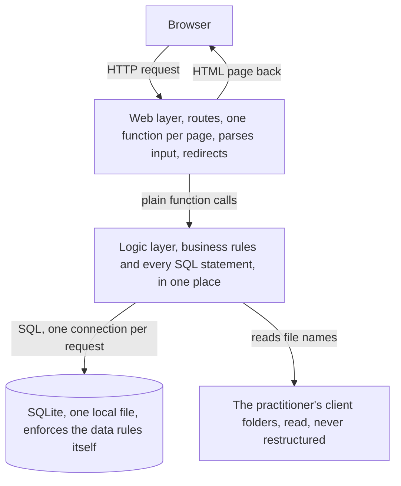

# TaxDesk

A local first compliance command center for solo Indian tax
practitioners and small accounting offices. It replaces the Excel
tick sheet used to track which client still owes which monthly
filing, and remembers where the proof file for every finished filing
lives. All data stays on the practitioner's own machine.

This repository is an in progress rebuild of the product, written by
hand as a learning exercise. The finished reference implementation is
preserved in the git tags `v0.5-reference` and `docs-reference`.

## The problem

A solo practitioner manages four recurring filings per client,
GSTR-3B, GSTR-1, EPF, ESI, tracked with hand ticks in a spreadsheet.
Ticks get forgotten, the sheet drifts from reality, and a missed
filing means a government penalty with a client's name on it. Proof
files, challans and acknowledgements, sit in client folders with no
link to the ticks.

The one question the product must answer every morning. Which clients
have pending GSTR-3B, GSTR-1, EPF, or ESI work this month, and where
is the proof for the finished ones.

## The architecture

A small web app running on localhost, one process, one database file.
Three layers, and each layer talks only to the one below it.



Why this shape. Pages must never contain business rules, rules must
never contain scattered SQL, and the hard guarantees, like no
duplicate task ever, live in the database itself where no code bug
can break them.

What the database holds, at the concept level.

- clients: each linked to its folder on disk
- services: the filing types
- client services: which filings each client needs
- periods: one row per tracked month
- tasks: the heart, one row per client per service per month, with
  status and proof
- documents: saved file links for search

Two structural promises. The Dashboard and the Priority list read the
same source with the same filters, so they can never disagree. And
every repeatable action, generating a month, rerunning setup, is
idempotent, running it twice changes nothing more than running it
once.

## What it must do

1. Onboard clients from the existing folder tree. The practitioner
   points the app at a root folder once, each subfolder becomes a
   client candidate, confirmed with checkboxes. Nothing auto creates.
2. Track which services each client needs. Switching a service off
   must never delete history.
3. Each month, generate one pending task per client per active
   service. Generating twice must never create duplicates.
4. Mark tasks done or not applicable, recording when and how. A
   finished month can be closed, and a closed month refuses changes.
5. Show a Dashboard with pending counts per service and the clients
   that still owe work, and a Priority page listing the same tasks
   grouped by service, searchable by client name.
6. Later, a Documents page searching saved file links, and a scanner
   that reads filenames in client folders, detects proof files, and
   suggests them for one click confirmation. Nothing marks itself
   done silently.

## What it must not be

- no cloud, no accounts, client data never leaves the machine
- no AI in version one
- no authentication in version one, it runs on localhost for one user
- not an accounting system replacement, not a portal automation

## Stack

Python, FastAPI, SQLite, Jinja2 templates, raw SQL with no ORM,
pytest for tests. Chosen for transparency, every layer must be
explainable by its builder.

## Running locally

```bash
python3 -m venv venv
venv/bin/pip install fastapi uvicorn
venv/bin/uvicorn app.main:app
```

The app serves on http://127.0.0.1:8000, uvicorn's own default, and
never pass a host flag, listening on localhost only IS the security
boundary of this local first product. Migrations run automatically at
startup. For development, `venv/bin/pip install httpx2 pytest` and
`venv/bin/pytest` runs the suite, and `python3 -m database.seed`
fills a development database.

## Build order

1. Database schema and a migration runner
2. Seed data for development
3. Client onboarding and service configuration pages
4. Periods, task generation, statuses, month closing
5. Dashboard and Priority
6. Documents and the proof scanner
7. Real trial in a working office

## Definition of done

The practitioner opens TaxDesk instead of Excel for one real month,
the counts are right, and finding a proof file is faster than the
file explorer.
