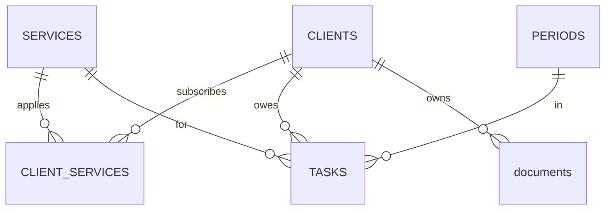

# TaxDesk Database Design

Source of truth is `database/schema.sql`. Brief notes on what it says
and why.

## Why a database

The product replaces a spreadsheet, and spreadsheets cannot enforce
rules. The schema stores the facts and makes the important rules
unbreakable at the engine level, duplicates, typo statuses, and
orphan rows are rejected on write, no matter which code writes.

## Entities

- CLIENTS: the practitioner's clients, folder path is their identity
  on disk, UNIQUE
- SERVICES: one row per filing type, a new filing is a row, not a
  schema change
- CLIENT_SERVICES: the many to many junction, keyed by the pair, with
  ACTIVE so switching a service off never erases history
- PERIODS: one row per tracked month, naturally keyed by year and
  month, open or closed
- TASKS: the heart, one row per client, service, and month, status
  locked to pending, done, not_applicable, due date nullable until
  real due days are confirmed
- documents: file links owned by a client, task linkage deliberately
  unresolved

## The key ideas, in one pass

- junction table: many to many needs its own table, the pair is the
  primary key
- composite key: PERIODS uses (year, month) because the real world
  fact is already unique
- surrogate key: TASKS uses a plain id because four columns are too
  wide to reference, while the natural identity stays enforced by
  UNIQUE (client, service, year, month), the single most important
  rule in the product
- primary key vs UNIQUE: identity vs additional rule, CLIENTS.ID vs
  CLIENTS.FOLDER_PATH shows the difference
- foreign keys: nothing points at nothing, tasks and documents cannot
  outlive their client
- normalization: every fact lives once, names are stored in one table
  and referenced by id everywhere else

## SQLite note

Foreign key enforcement is off per connection by default and cannot
be stored in the schema. Every connection must run
`PRAGMA foreign_keys = ON`, the migration runner will own a single
connect function so it is never forgotten.

## Decisions and deferrals

Chosen: services as data, natural period key, text dates in ISO
format, no indexes until a measured slow query exists.

Deferred on purpose: the task to document link, document date fields
for search by year, a settings table, and the real due day values.

## In one interview breath

Six tables model a tax office. A junction table carries the many to
many between clients and services with a soft off switch, months are
naturally keyed, and tasks enforce their natural identity through a
UNIQUE constraint so duplicate work items are impossible at the
engine, not by code discipline.

## Next

The migration runner, one connect function with the PRAGMA, applies
this schema to a fresh database exactly once, recorded.
