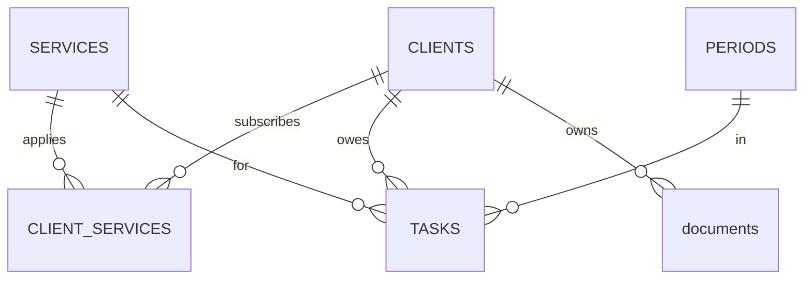

# TaxDesk Database Design

Source of truth is `database/migrations/`, numbered SQL files applied
in order. Brief notes on what they say and why.

## Why a database

The product replaces a spreadsheet, and spreadsheets cannot enforce
rules. The schema stores the facts and makes the important rules
unbreakable at the engine level, duplicates, typo statuses, and
orphan rows are rejected on write, no matter which code writes.

## Entities



- CLIENTS: the practitioner's clients, folder path is their identity
  on disk, UNIQUE
- SERVICES: one row per filing type, a new filing is a row, not a
  schema change
- CLIENT_SERVICES: the many to many junction, keyed by the pair, with
  ACTIVE so switching a service off never erases history
- PERIODS: one row per tracked month, naturally keyed by year and
  month, open or closed
- TASKS: the heart, one row per client, service, and month, status
  locked to pending, done, not_applicable, due date nullable until
  real due days are confirmed
- documents: file links owned by a client, task linkage deliberately
  unresolved
- SETTINGS: the app's configuration as one typed row, a CHECK on ID
  makes a second row impossible, no row means not configured yet.
  Deliberately not a key value store, one known value exists, the
  root folder, and a future value is a migration adding a column

## The key ideas, in one pass

- junction table: many to many needs its own table, the pair is the
  primary key
- composite key: PERIODS uses (year, month) because the real world
  fact is already unique
- surrogate key: TASKS uses a plain id because four columns are too
  wide to reference, while the natural identity stays enforced by
  UNIQUE (client, service, year, month), the single most important
  rule in the product
- primary key vs UNIQUE: identity vs additional rule, CLIENTS.ID vs
  CLIENTS.FOLDER_PATH shows the difference
- foreign keys: nothing points at nothing, tasks and documents cannot
  outlive their client
- normalization: every fact lives once, names are stored in one table
  and referenced by id everywhere else

## SQLite note

Foreign key enforcement is off per connection by default and cannot
be stored in the schema. Every connection must run
`PRAGMA foreign_keys = ON`, the migration runner will own a single
connect function so it is never forgotten.

## Decisions and deferrals

Chosen: services as data, natural period key, text dates in ISO
format, no indexes until a measured slow query exists.

Deferred on purpose: the task to document link, document date fields
for search by year, and the real due day values.

## In one interview breath

Six tables model a tax office. A junction table carries the many to
many between clients and services with a soft off switch, months are
naturally keyed, and tasks enforce their natural identity through a
UNIQUE constraint so duplicate work items are impossible at the
engine, not by code discipline.

## The migration runner

`database/migrate.py` owns two jobs.

- connect(): the only sanctioned way to open the database. It opens
  or creates `database/taxdesk.db` and switches foreign keys on, so
  no caller can forget the per connection pragma.
- initialize(): applies every pending file from
  `database/migrations/` in filename order, exactly once each per
  database. Each file and its logbook record are wrapped in one real
  SQLite transaction, BEGIN and COMMIT carried inside the executed
  script, because executescript commits on its own and driver level
  commits cannot make the pair atomic. A failure mid file rolls back
  completely, tables and record together, proven by test. Existing
  data is never recreated or deleted, applied files are frozen, a
  schema change is always a new numbered file, and migration files
  must not manage transactions themselves.

```bash
python3 database/migrate.py          # database/taxdesk.db
venv/bin/pytest                      # the database test suite
```

## Required services live in the runner

Three kinds of content, three homes. Structure lives in `schema.sql`.
Required reference data, the four filing types the product cannot run
without, lives as a REQUIRED_SERVICES list in `migrate.py`, ensured
with INSERT OR IGNORE on every initialize call. Fake development data
lives in the seed.

Why not in schema.sql, that file is an applied migration, sealed once
a database has run it, so an edit there never reaches existing
databases. A name appended to the list reaches every database on its
next initialize call, idempotently. The development seed only invents
fake things, clients, subscriptions, one month, generated tasks.

```bash
python3 -m database.seed             # fill a development database
```

The seed is rerunnable, every write is INSERT OR IGNORE or a
deterministic UPDATE, and its generation query is the same shape the
app will use, one task per active subscription, duplicates absorbed
by the UNIQUE rule on TASKS.

## Next

The web skeleton and the onboarding pages, the first thing to click.
