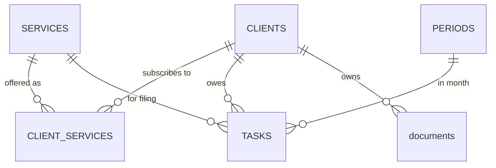

# TaxDesk Database Design

Source of truth is `database/schema.sql` on this branch. This report
explains what it says and why, for a fresher learning the codebase.

## Why the database exists

TaxDesk replaces an Excel tick sheet, and the reason Excel fails is
that it cannot enforce rules. Nothing stops a duplicate row, a typo
status, or a tick for a client that does not exist. A relational
database stores facts AND enforces rules on every write, no matter
which code performs it. The rules are half the design.

## Entities and relationships

Five entities. Clients are who dad works for. Services are the filing
types. Client services records which client needs which filing.
Periods are tracked months. Tasks are the heart, one row means one
client owes one filing for one month. Documents are saved file links
belonging to a client.

## The many to many, clients and services

One client needs several services, and one service applies to many
clients. Neither table can hold that fact alone, a column on CLIENTS
could hold one service, not four. The standard answer is a junction
table, CLIENT_SERVICES, one row per client and service pair. Its
primary key is the pair itself, so the same pair cannot exist twice.

## Composite primary keys

A composite key is a primary key made of more than one column.

- CLIENT_SERVICES: the pair (CLIENT_ID, SERVICE_ID) is the row's
  identity, no artificial id needed
- PERIODS: (YEAR, MONTH) is naturally unique, August 2026 can only
  exist once, so the real world fact is the key

## Primary key versus UNIQUE

Both prevent duplicates. The difference is the job. The primary key
is the row's identity, the value other tables point at. UNIQUE is an
extra rule on top, any other column set that must never repeat.
CLIENTS shows both, ID is the identity, FOLDER_PATH is UNIQUE because
two clients can never share a folder, but nothing points at a folder
path.

## The surrogate key on TASKS

TASKS has a natural identity, the four columns client, service, year,
month. Using all four as the primary key would work, but everything
that ever points at a task, a status update, a future document link,
would need to carry four columns. So TASKS uses a surrogate key, a
plain ID with no business meaning, and keeps the natural identity as
a UNIQUE constraint. Identity stays cheap to reference, the business
rule stays enforced. Both tools, each doing its own job.

## Foreign keys and referential integrity

A foreign key column holds another table's primary key, and the
engine refuses values that point at nothing. That is referential
integrity, no task for a deleted client, no document for a client
that never existed, no task in a month that was never created. The
validation run proved each of these rejections with real inserts.

## Normalization

Each fact lives in exactly one place. A service's name exists once in
SERVICES, tasks store the service id, never the text, so renaming a
service touches one row and nothing can drift. Same with clients and
periods. The test for a normalized design, updating one real world
fact should change one row.

## Business invariants, the rules the engine enforces

- one client, one service, one month, at most one task:
  UNIQUE on TASKS
- two clients can never share a folder: UNIQUE on FOLDER_PATH
- service names cannot repeat: UNIQUE on SERVICES.NAME
- a client and service pair exists once: the composite primary key
- statuses are only the values the product means:
  CHECK on STATUS and STATE
- months are real months: CHECK on MONTH and YEAR ranges
- nothing points at nothing: the foreign keys

## Historical data and the ACTIVE flag

When dad stops a service for a client, the fact that it was once
active must survive, old tasks still reference that pair. So the
relationship is never deleted, ACTIVE flips to 0. Deactivation is a
state change, deletion is amnesia.

## Period lifecycle

A period is born open and can be closed when the month is finished,
STATE holds which. Closed means frozen, no new tasks, no status
changes. The schema stores the state, refusing writes against a
closed month is application behavior, built later in the app layer.

## The SQLite foreign_keys PRAGMA

SQLite ships with foreign key enforcement OFF for every new
connection, and the switch cannot be stored in the database or this
schema. Every piece of code that connects must run
`PRAGMA foreign_keys = ON` right after opening. The migration runner
will own a single connect function so the switch is never forgotten.

## Table by table

- CLIENTS: identity, name, and the folder path that is the client's
  identity on disk
- SERVICES: one row per filing type, a fifth filing someday is a new
  row, not a schema change
- CLIENT_SERVICES: the junction, plus ACTIVE for history
- PERIODS: one row per tracked month, naturally keyed, open or closed
- TASKS: the heart, status defaults to pending, due date nullable
  until dad confirms real due days, completion fields nullable
  because a pending task has no completion
- documents: file links owned by a client, searchable by client

## Design decisions and rejected alternatives

- services as a lookup table, rejected alternative, a fixed list
  baked into a CHECK constraint. The table wins on flexibility, a new
  filing is data. The cost, nothing stops a misspelled service row,
  seed data must insert the known four.
- natural key on PERIODS, rejected alternative, a surrogate id. The
  natural key is self evident and cannot drift, the cost is two
  columns in every reference.
- surrogate key on TASKS, rejected alternative, the four column
  natural primary key, too wide to reference comfortably.
- dates as TEXT, SQLite has no real DATE type, pretending otherwise
  invites silent surprises. One format, ISO, decided once.
- no indexes yet, rejected alternative, indexing the foreign keys now.
  At one office's scale every scan is instant, indexes get added when
  a real query is measured slow, and the first candidate is already
  known, tasks by period and status.

## Intentionally deferred

- the task to document relationship, left unresolved on purpose until
  a requirement forces a shape
- document year and date fields, needed by search by year, waiting on
  the same discussion
- a settings table for the root folder path, waiting until the reason
  it exists is understood, one discussion away
- real due day values per service, dad confirms them later, the
  nullable DUE_DATE is the placeholder

## Interview ready explanation

Six tables model a tax office. Clients and services meet in a
junction table because the relationship is many to many, with an
active flag so switching a service off never erases history. Months
are naturally keyed by year and month. Tasks carry a surrogate id but
enforce their natural identity, client plus service plus month,
through a UNIQUE constraint, which makes duplicate work items
impossible at the engine level rather than by code discipline. All
rules that must never break, uniqueness, legal statuses, referential
integrity, live in the schema as constraints, so no application bug
can violate them.

## Concepts learned here

Entity, relationship, junction table, composite key, surrogate versus
natural key, primary key versus UNIQUE, foreign key, referential
integrity, normalization, CHECK constraints as enums, soft deletion
via a flag, and the SQLite per connection foreign key switch.

## Next step

The migration runner, a small Python file owning two jobs, the one
sanctioned connect function with the PRAGMA, and applying this schema
to a fresh database exactly once, recorded, so every machine reaches
the identical structure.
